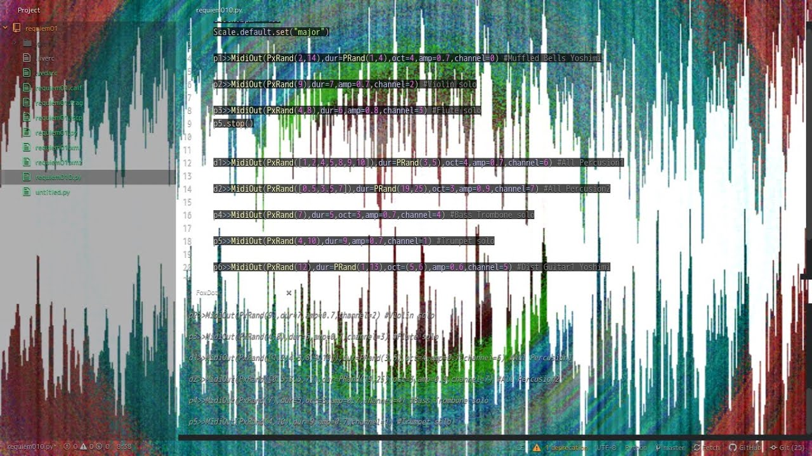
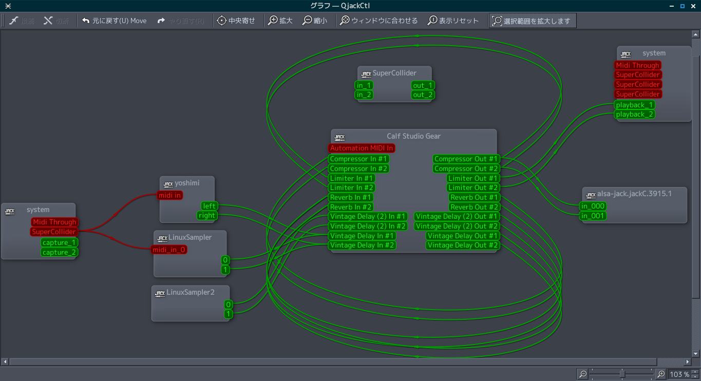

# Improvised-Requiem-01

https://www.youtube.com/watch?v=nIYLWH8jplw

FoxDot livecoding and MIDI playing on Linux DTM

This program is very simple and profound. The basic settings are C Major and 100 BPM.
Foxdot keeps sending random signals through supercollider by python's PxRand function. The sound font assigned to a MIDI channel plays a single sound in a given range and number of beats. Performer can indicate when to start and end, and sometimes even change the value of the parameter.
Sonatina Symphonic Orchestra insists, and intricately entwines, sometimes forming chords, sprout an emotion in people's minds. It is similar to the feeling of facing nature. The signals randomly emitted by the PxRand function inevitably shake our emotions, just as the clouds in the sky change shape.
We think that there is never the same performance in this Internet world. And I hope many people enjoy music through this program.

